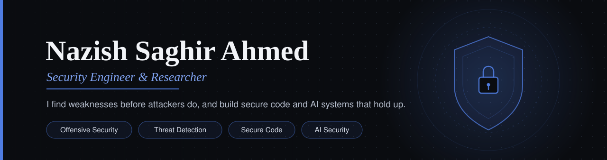

<div align="center">




<br/>

<a href="#"></a>
<a href="#"></a>
<a href="#"></a>

</div>

<br/>

## About Me

**BS Cybersecurity student at UET Lahore**, building a foundation in software development and offensive security from the ground up.

This repository is my public learning log — real projects, honest progress, and a record of how my skills are developing over time.

> *AI helps me move faster. Understanding is what makes the progress real.*

<br/>

## Tech Stack & Tools

<div align="center">


<br/><br/>


</div>

<br/>

## Featured Projects

<div align="center">

<table>
<tr>
<td width="50%" valign="top">

### ThreatLens
OSINT threat-intel dashboard pulling live IOCs from ThreatFox (abuse.ch) with search, filtering, and visualizations.

`Python` `Streamlit` `Pandas` `Plotly`

</td>
<td width="50%" valign="top">

### AI Projects
LLM, RAG, and AI-assisted application experiments.

`Coming Soon`

</td>
</tr>
<tr>
<td width="50%" valign="top">

### CTF Write-ups
Documented offensive security notes from HTB / THM machines.

`Coming Soon`

</td>
<td width="50%" valign="top">

### Java & OOP Projects
Applied object-oriented design projects built while strengthening Java fundamentals.

`Coming Soon`

</td>
</tr>
</table>

</div>

<br/>

## Current Progress

```text
Python           ████████░░  80%
Java / OOP       ███░░░░░░░  30%
Cybersecurity    ███░░░░░░░  30%
AI / LLMs        ███░░░░░░░  30%
Offensive Sec    ██░░░░░░░░  20%
```

<br/>

## Roadmap

<table>
<tr>
<td valign="top" width="50%">

**Done**
- Learn Python fundamentals
- Get hands-on with Kali Linux & CLI
- Start solving HTB / THM machines
- Explore Burp Suite for web application testing

</td>
<td valign="top" width="50%">

**Next**
- Strengthen Java and object-oriented programming
- Go deeper on networking and Linux internals
- Ship more AI-powered projects
- Document CTF write-ups properly
- Contribute to open-source security tools

</td>
</tr>
</table>

<br/>

## AI-Assisted Learning

AI is part of how I learn — not a replacement for it. I use it to understand unfamiliar concepts quickly, debug code, and stay unstuck without losing sight of *why* something works.

> The goal isn't to generate code. The goal is to understand it.

<br/>

## GitHub Stats

<div align="center">


<br/>


</div>

<br/>

## About This Journey

Running someone else's tool and understanding what it's actually doing under the hood are two different things. I'm building that understanding deliberately — learning in public rather than presenting a polished-looking finish line.

**Everyone starts somewhere. This is where I started — and where I keep going.**

<br/>

<div align="center">

**This repository grows as I grow.**

If something here is useful, a star is appreciated.

</div>
